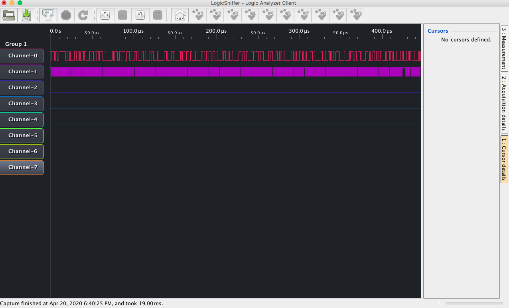
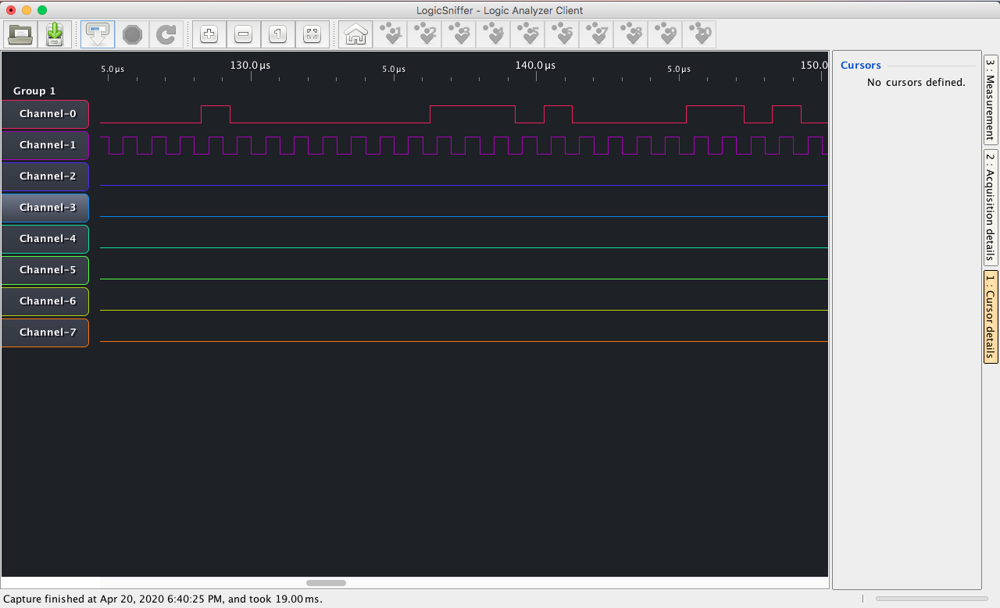

# Analizador con arduino y app en java

- Analizador descargado de https://www.lxtreme.nl/ols/ | https://github.com/jawi/ols

- Codigo para cargar a arduino: https://github.com/gillham/logic_analyzer

